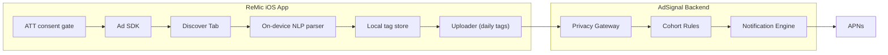

# Hackathon Report — Building AdSignal

This report outlines how to **build AdSignal** at a hackathon, based on prior brainstorming and design documentation. It’s structured as a tech specification and playbook so you can execute quickly during your next event.

Idea: Instead of trying to directly track user browsing/search behavior (which Apple locks down), you piggy-back on the ads already being delivered to the user. Since ad networks (Google, Meta, etc.) optimize ads based on the user’s recent cross-app/web activity, the ads themselves become a “proxy signal” for the user’s current interests. Let me break it down.

---

## 15-second founder networking pitch

⚡ “AdSignal turns ads into signals of user intent. We lightly tap into the ads users already see, interpret them with AI, and trigger perfectly timed re-engagement nudges. It’s like piggy-backing on Google and Meta’s billions in ad spend to power retention—without extra CAC.”

## 1-minute elevator pitch

🚀 *“Most apps fail at re-engagement because push notifications are generic and mistimed. At the same time, Google and Meta already spend billions figuring out exactly what users care about right now—through the ads they show. AdSignal taps into those ad streams, with user consent, and treats every ad as a real-time signal of intent. If a user is suddenly flooded with travel ads, that’s the perfect moment to nudge them with: ‘Traveling soon? Use ReMic to speak like a local.’

Our platform makes this turnkey: SignalTap captures ad metadata on-device, AdEcho interprets it into interest tags, Reverb turns those into personalized notifications, and Pulse tracks results. The magic is we’re not building a new tracking system—we’re piggy-backing on the biggest ad networks in the world, using their spend as our intelligence layer.

The result? Push notifications that feel timely, contextual, and human—lifting retention and engagement without raising customer acquisition costs. That’s AdSignal.”*

---

## 1. Hackathon Goal

- Prototype **AdSignal**, a system that turns ads shown in your iOS app into **signals of user intent**.
- Show how these signals can trigger **timely, personalized notifications** that drive re-engagement.
- Deliver a working demo + a compelling story for judges/investors.

---

## 2. Core Concept

> Ads served by Google/Meta SDKs are already personalized based on user activity. By parsing these ads on-device, abstracting intent tags, and feeding them into a backend engine, we can trigger re-engagement nudges that align with the user’s real-time interests.

---

## 3. Hackathon MVP Scope

- **iOS App (ReMic fork/demo):**
  - Integrate Ad SDK (AdMob or Meta Audience Network).
  - Add a *Discover Tab* to render ads.
  - Prefetch ads opportunistically.
- **On-device Ad Parser:**
  - Extract titles and metadata.
  - Map to simple categories (travel, education, dating, etc.).
- **Backend Service:**
  - Collect aggregated tags daily.
  - Run simple rules (≥70% travel ads = travel cohort).
  - Map cohorts to notification templates.
- **Push Notification Demo:**
  - Trigger via APNs with personalized text.

---

## 4. Architecture

### High-Level System



### Notification Trigger Example

```mermaid
sequenceDiagram
  participant iOS as "ReMic iOS"
  participant SDK as "Ad SDK"
  participant NLP as "Parser"
  participant BE as "Backend"
  participant APNs as "APNs"

  iOS->>SDK: "prefetch ads"
  SDK-->>iOS: "ad objects"
  iOS->>NLP: "parse ads"
  NLP-->>iOS: "tags {travel:0.8}"
  iOS->>BE: "upload tags"
  BE-->>BE: "if travel > 0.7 → cohort=travel"
  BE->>APNs: "push 'Travel soon? Use ReMic'"
  APNs-->>iOS: "notification delivered"
```



---

## 5. Module Names

- **AdSignal** (umbrella)
- **SignalTap** → On-device capture
- **AdEcho** → Intent extraction
- **Reverb** → Notification orchestration
- **Pulse** → Analytics view (optional)

---

## 6. Hackathon Deliverables

1. **Demo App:** iOS app with Discover tab + push notification demo.
2. **Backend Stub:** Simple Node.js/TS server with rule-based cohort detection.
3. **Notifications:** At least 2 contextual notification examples (travel, education).
4. **Pitch Slide:** Explaining AdSignal → SignalTap → AdEcho → Reverb.
5. **Architecture Diagram:** As above, included in slides.

---

## 7. Storytelling Angle

- **Problem:** Notifications are generic and ignored; retention is expensive.
- **Solution:** Ads already reflect intent → AdSignal converts them into smart nudges.
- **Demo:** User opens Discover → sees travel ads → later receives travel-specific notification.
- **Vision:** AdSignal as the “intent OS” for mobile apps.

---

## 8. Hackathon Execution Checklist

-

---

## 9. Key Takeaway

AdSignal is a **hackable but powerful concept**: turning ad networks’ personalization into a free source of intent signals, and converting those signals into **high-conversion notifications**. At a hackathon, even a simple demo (ad → travel tag → push notification) can powerfully showcase the idea and vision.


---

# AdSignal Hackathon Build Report (Runbook)

> A practical blueprint to build and demo **AdSignal** in a 24–36 hour hackathon. This report assumes the methodology and diagrams above; it focuses on scope, roles, tasks, data contracts, guardrails, and a precise demo script.

## 0) TL;DR

- Build a **Discover** tab that shows ads via Ad SDK(s).
- On-device, parse ad text → map to **interest tags** (e.g., `travel`, `education`).
- Upload **daily aggregated** tags (no raw creatives) to the backend **Privacy Gateway**.
- Backend turns tags into **re-engagement notifications** via rules/A-B.
- Demo: see travel ads → receive “Travel with ReMic” push → open deep link → run a travel phrase practice.

---

## 1) Goals & Success Criteria

**Primary Goal:** Demonstrate end-to-end signal → notification loop in a single device.

**Success Criteria**

- ✅ Ads render in **Discover**.
- ✅ On-device tag extraction works (debug view shows `{travel:0.8}` etc.).
- ✅ Aggregated payload reaches server (logs + dashboard).
- ✅ Rule fires → APNs delivers push within 30s in demo mode.
- ✅ Deep link opens the app to **Practice/Travel** screen.
- ✅ Metrics recorded: push sent/opened, session start, conversion.

**Nice-to-Haves**

- Cohort dashboard (**Pulse**) with simple charts.
- A/B variant toggles for message copy.
- Throttling/fatigue keys per trigger.

---

## 2) Scope & Non‑Goals

**In‑Scope**

- iOS client with Ad SDK (AdMob as default), Discover UI, on-device parser, local store & uploader.
- Minimal backend: Privacy Gateway (HTTP), Rules/Scorer, Notification service to APNs, Metrics sink.
- Opt-in UX for **Interest-based Tips** (separate from ATT).

**Out‑of‑Scope (Hackathon)**

- Multi-language push localization (can be stubbed).
- Complex ML; start with keyword/regex + optional tiny Core ML.
- Cross-platform clients.
- Data warehouse/BI; use logs + a lightweight dashboard.

---

## 3) Roles (or Tracks if Solo)

- **iOS Lead (SignalTap)**: SDK integration, parser, local store, debug UI, deep links.
- **Backend Lead (Reverb)**: Gateway, rules engine, notifier (APNs), metrics endpoints.
- **NLP/ML (AdEcho)**: Tag taxonomy, keyword lists, lightweight classifier.
- **Demo/PM (Pulse)**: Privacy copy, opt-ins, scripts, slides, timing.

If solo: do them **in this order** → iOS Discover → Parser+Debug → Gateway+Notify → Rules → Opt-in → Dashboard → Polish.

---

## 4) Implementation Plan (Hour Blocks)

### Phase A — iOS Client (0–8h)

1. **Project setup**: add AdMob SDK, enable ATT prompt, add **Discover** tab.
2. **Render ads**: banner/native ad list; add **Prefetch** button (avoid BG fetch fragility for demo).
3. **Parser stub**: extract `title`, `body`, `category` when exposed; run keyword map → tag scores.
4. **Debug overlay**: show latest tags JSON and confidence.
5. **Local store**: roll up daily `{tag: score}` in SQLite/CoreData.
6. **Uploader**: POST aggregated tags to `/v1/interests` on demand (debug button) and on app foreground.

### Phase B — Backend (6–14h)

1. **Privacy Gateway** (Express/FastAPI): auth token, schema validation, log to stdout + KV.
2. **Rules/Scorer**: simple thresholds, e.g., `travel ≥ 0.6` in last 24h → `travel_interest_high`.
3. **Notifier**: APNs token-based auth; send push with deep link `remic://practice/travel`.
4. **Metrics**: `/v1/events` for `push_sent`, `push_open`, `conversion_travel_practice`.

### Phase C — UX & Compliance (10–16h)

1. **Opt-in screen**: “Enable Interest-based Tips” toggle (separate from ATT).
2. **Privacy copy**: “We derive coarse interests on-device from ad text; we upload only daily aggregates. You can turn this off anytime.”
3. **Throttling**: client-side & server-side fatigue key `travel_nudge` ≤ 1 per 7 days (hackathon: 1 per 3 min in demo mode).

### Phase D — Dashboard (14–20h)

1. Simple web page (Next.js/React) to list last N interest snapshots and pushes sent.
2. Tiny chart for **Pulse** (tag trends last 24h).

### Phase E — Polish & Rehearsal (20–24/36h)

- Run the end-to-end loop 5x. Record timings, ensure push reliability. Prepare fallback if APNs flaky (in-app banner).

---

## 5) Data Contracts (Minimal, Stable)

### Device → Gateway `/v1/interests`

```json
{
  "user_id": "hashed_user_id",    
  "day": "2025-08-24",
  "cohorts": [
    {"name": "travel", "score": 0.74},
    {"name": "airline", "score": 0.61}
  ],
  "source": "ad_observation_v1",
  "counts": {"ads_seen": 12, "sdk": {"admob": 9}},
  "app": {"ver": "1.3.0", "ios": "18.0"}
}
```

### Gateway → Rules (internal event)

```json
{
  "user_id": "hashed_user_id",
  "window_hours": 24,
  "tags": {"travel": 0.74, "airline": 0.61}
}
```

### Rules → Notifier (trigger)

```json
{
  "user_id": "hashed_user_id",
  "trigger": "travel_interest_high",
  "variant": "travel_nudge_v2",
  "message": "Planning a trip? Use ReMic to speak like a local.",
  "deep_link": "remic://practice/travel",
  "throttle_key": "travel_nudge",
  "demo_mode": true
}
```

### Client → Metrics `/v1/events`

```json
{
  "user_id": "hashed_user_id",
  "events": [
    {"name": "push_sent", "ts": 1724630400},
    {"name": "push_open", "ts": 1724630452},
    {"name": "conversion_travel_practice", "ts": 1724630467}
  ]
}
```

---

## 6) Tag Taxonomy (v0)

- **travel**, airline, hotel, visa, insurance
- **education**, language\_learning, tutoring
- **dating**, social, events
- **finance**, banking, credit\_card
- **shopping**, deals, coupons

Start with ≤30 tags; maintain as a static JSON delivered with app; allow hotfix via remote config.

---

## 7) On-Device Parser (AdEcho v0)

- **Inputs**: ad `title`, `body`, `callToAction`, `category` (when exposed by SDK).
- **Algorithm**: keyword list with weights + simple normalization; optional Core ML text classifier (MobileBERT mini) if time permits.
- **Output**: `{tag: score}` map with values in `[0,1]` and overall confidence.
- **Privacy**: do **not** store raw strings; persist only derived tags.

**Pseudocode**

```swift
struct TagScore { let name: String; var score: Double }
let keywords: [String: [String: Double]] = [
  "travel": ["flight":0.6, "airline":0.5, "hotel":0.4, "visa":0.4, "luggage":0.3],
  "education": ["course":0.5, "learn":0.4, "lesson":0.4, "language":0.6]
]
func tags(from text: String) -> [TagScore] {
  var scores: [String: Double] = [:]
  for (tag, dict) in keywords {
    for (kw, w) in dict where text.lowercased().contains(kw) { scores[tag, default:0] += w }
  }
  let maxScore = max(scores.values.max() ?? 1, 1)
  return scores.map { TagScore(name: $0.key, score: min($0.value / maxScore, 1.0)) }
}
```

---

## 8) Rules & Throttling (Reverb v0)

- Trigger: if travel ≥ 0.6 in last 24h and travel_nudge not sent in last 7d → enqueue push.
- Demo Mode: window=2m, fatigue=3m, so judges see immediate result.
- A/B: toggle travel_nudge_v1 vs v2 copy.

---

## 9) Notification Delivery

- APNs with token-based auth (P8 key). Category = travel_tip. Deep link = remic://practice/travel.
- Fallback: if APNs fails, display in-app banner when app foregrounded.

---

## 10) Privacy & Compliance Guardrails

- ATT consent required before enabling SignalTap.
- Separate toggle for Interest-based Tips (purpose limitation, explicit opt-in).
- Store only aggregated tags; no raw creatives, IDs, or click trackers.
- Rate-limit uploads; implement delete data endpoint per user.
- Document flows in Privacy Policy; easy opt-out in Settings.

---

## 11) Testing Checklist

- Simulator + device test for ATT + ad rendering.
- Parser unit tests: input strings → expected tags.
- End-to-end: button → upload → rule → push (record timestamps).
- Negative tests: no ATT consent → SignalTap disabled.
- Fatigue tests: ensure repeated triggers are suppressed.

---

## 12) Demo Script (5 minutes)
1. Open ReMic → toggle “Interest-based Tips” → Discover tab.
2. Tap Prefetch Ads → show ads + Debug overlay with {travel:0.8}.
3. Tap Send Snapshot (uploads aggregates) → backend logs show receipt.
4. Push arrives: “Planning a trip? Use ReMic to speak like a local.”
5. Tap notification → deep link opens Travel Practice screen.
6. Show Pulse dashboard: tags, push sent/opened, conversion.
7. Close with guardrails (privacy, ATT, aggregates only) and roadmap.

---

## 13) Stretch Goals

- On-device Core ML classifier fine-tuned on ad snippets.
- Multi-network support (Meta Audience Network) with adapter interface.
- Real-time edge rules (Cloudflare Workers) for faster pushes.
- Cohort personalization (beginner vs advanced learners).
- Basic revenue estimate: lift in 7-day retention → LTV gain.

---

## 14) Risks & Mitigations

- Ad SDK ToS: analyze only exposed text; no scraping of assets.
- APNs unreliability: keep in-app banner fallback; cache deep link action.
- Background fetch limits: drive via user action during demo; BG later.
- No travel ads served: include mock ad toggle that feeds parser with travel keywords.

---

## 15) Appendix — Minimal Backend (Express)

```javascript
import express from "express";
const app = express();
app.use(express.json());
app.post("/v1/interests", (req, res) => {
  console.log("interests", req.body);
  // TODO: store + evaluate rules; enqueue APNs
  res.sendStatus(202);
});
app.post("/v1/events", (req, res) => { console.log("events", req.body); res.sendStatus(202); });
app.listen(8787, () => console.log("gateway up"));
```

---

## 16) Appendix — Notification Copy Bank
- Travel: “Planning a trip? Use ReMic to speak like a local.”
- Education: “Learning Spanish? Practice a conversation with ReMic today.”
- Dating: “Meeting new people? Break the ice in their language with ReMic.”
- Return: “Welcome back! Pick up where you left off with ReMic.”

---

## 17) Final Notes

Ship the happy path first. Optimize for a crisp, repeatable demo that proves the loop: ads → tags → rule → push → deep link → practice. Then iterate.

## Credit

Huan Li <https://github.com/huan>
