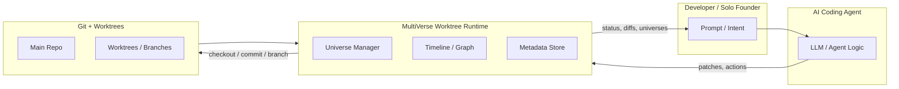
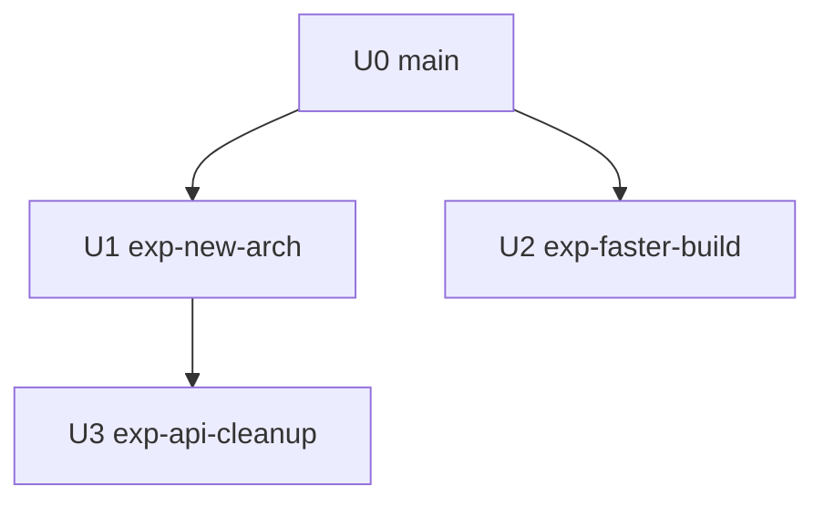
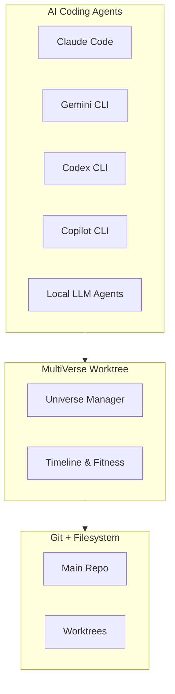

# MultiVerse Worktree (MVW)

## An Evolutionary Runtime for AI Coding Agents

> *A Ship.Fail hackathon idea by Huan — extending EvoPM into a concrete infrastructure layer for AI co-founders.*

---

## 1. Why We Need a MultiVerse Worktree

In 2025, almost every serious developer has tried at least one AI coding agent:

* Claude Code
* Gemini CLI
* OpenAI Codex CLI
* GitHub Copilot CLI
* local LLM CLIs (Ollama, llama.cpp, etc.)

All of them can:

* write code
* refactor
* explain errors
* generate tests

But almost none of them can do the one thing that real engineering **actually** needs:

> **Treat a project as a universe that can be forked, explored, replayed, and evolved.**

Instead, we get **linear sessions**:

1. Prompt → agent edits files
2. Prompt → more edits
3. Prompt → more edits
4. Realize prompt #2 was wrong
5. Everything downstream is now polluted

The only realistic option is:

```bash
# Reset, pray, or manually clean up
```

The problem is not the models.

The problem is the **runtime**.

Right now, AI coding agents sit on top of a filesystem and a Git repo that were never designed for **branching, multi-universe, AI-driven experimentation**.

This post is my attempt to fix that — or at least define the blueprint clearly enough that Future Me (and future collaborators) can pick it up and turn it into a real product under **Ship.Fail**.

I call it:

> **MultiVerse Worktree (MVW)** — a framework that lets AI agents treat your project as an evolving multiverse of Git-backed universes.

---

## 2. EvoPM: The Philosophy Behind MVW

This idea doesn’t come from nowhere. It builds on an earlier hackathon concept I called **EvoPM — Evolutionary Project Management**.

EvoPM is based on a simple observation:

> Great projects don’t follow a straight line. They evolve.

If you zoom out, a real project looks less like a roadmap and more like an evolutionary tree:

* New ideas (mutations) appear
* Some die quickly
* Some survive and become the mainline
* Some sit on branches that never merge back

### 2.1 Key EvoPM Concepts

From my EvoPM notes (paraphrased and extended from memory):

* **Mutation** – Every change (prompt, patch, refactor, architecture idea) is a mutation applied to the current project genome.
* **Selection** – We don’t keep every mutation. We select for fitness: passing tests, performance, simplicity, maintainability, business value.
* **Branching Universes** – Instead of overwriting the project, we spawn multiple universes that evolve in parallel.
* **Prompt-as-Commit-Message** – Each AI interaction (prompt → agent action) becomes a commit with rich metadata.
* **Agents as Evolutionary Optimizers** – The AI isn’t just a code generator; it’s an evolutionary engine exploring the search space of possible implementations.
* **Fitness Functions** – Tests, metrics, benchmarks, human feedback, and business goals act as fitness signals.

EvoPM says:

> **Treat your project as an evolving organism, not a static codebase.**

MVW is the concrete runtime that makes this philosophy real.

---

## 3. What Is MultiVerse Worktree (MVW)?

Let’s define it.

> **MultiVerse Worktree (MVW)** is a Git-based runtime that lets AI coding agents treat a repository as a multiverse of parallel "universes," each universe being a worktree (or equivalent) with:
>
> * its own branch
> * its own state
> * its own history of prompts and actions
> * and a clear relationship to other universes in an evolutionary tree.

In other words:

* **Universe** = a specific project state (Git commit + working tree)
* **Prompt** = a decision that leads to a commit (and possibly a new branch)
* **Agent** = a process that mutates universes based on prompts
* **MVW** = the layer managing universes, metadata, and evolutionary history

Instead of letting the agent touch your working directory directly, MVW sits between the agent and Git.

The agent never edits `main` directly. It edits **universes**.

---

## 4. High-Level Architecture

At a high level, MultiVerse Worktree looks like this:



Conceptually:

1. You (or another agent) send a prompt.
2. The AI agent proposes changes.
3. MVW:

   * forks a universe (if needed)
   * checks out the right worktree
   * applies changes
   * commits with metadata
4. MVW records the evolutionary graph in its own metadata store.
5. You can later:

   * list universes
   * compare them
   * replay decisions
   * prune dead branches

---

## 5. Git as the MultiVerse Engine

The magic is that we **don’t need to invent a new VCS**.

Git already gives us:

* branches
* commits
* tags
* worktrees
* diffs
* merges
* reflogs

MVW is a thin (but opinionated) layer on top.

### 5.1 Universe as Worktree

Each **Universe** `U#` is implemented as a Git branch + optional worktree.

Example directory structure:

```text
my-project/
  .git/
  .mvw/
    universes/
      U0-main.yml
      U1-exp-faster-build.yml
      U2-exp-new-arch.yml
    timeline.yml
    config.yml

  # Primary working tree (maybe U0)
  src/
  tests/
  ...

  # Additional worktrees (managed by MVW)
  ../my-project-U1-worktree/
  ../my-project-U2-worktree/
```

### 5.2 Creating a New Universe

Instead of:

```bash
git checkout -b exp-new-arch
```

You (or the agent) do:

```bash
mvu fork --from U0 --name U1-exp-new-arch
```

Under the hood, MVW runs something like:

```bash
git worktree add ../my-project-U1-worktree mvw/U1-exp-new-arch
```

…and writes metadata into `.mvw/universes/U1-exp-new-arch.yml`.

### 5.3 Prompt-as-Commit-Message

Every AI interaction becomes a commit with rich metadata.

Example commit message:

```text
[mvw] U1: Implemented async handler for /events

Prompt:
"Refactor the /events route to be fully async, add logging, and improve error handling.
Make sure existing tests pass."

Model: claude-3.7-sonnet
Temperature: 0.4
Fitness: tests=pass; coverage=+3%
Parent Universe: U0
```

This makes every decision **replayable**, **inspectable**, and **auditable**.

---

## 6. Mini RFC: MVW Concepts & Operations

This section is a **mini RFC** for Future Me (and future contributors).
It’s intentionally concrete, so you can reconstruct the system months or years later just by reading this.

### 6.1 Core Concepts

* **Universe (U)**

  * A named instance of the project state
  * Backed by a Git branch (and optionally a worktree)
  * Has metadata:

    * `id`, `name`
    * `parent_universe_id`
    * `created_by_prompt`
    * `created_by_agent`
    * `created_at`
    * `tags` (e.g., `candidate`, `winner`, `dead`, `arch-experiment`)

* **Timeline / Evolution Graph**

  * Directed acyclic graph (DAG) of universes
  * Each edge: `parent_universe -> child_universe`
  * Stored in `.mvw/timeline.yml` or similar

* **Mutation**

  * A change to a universe produced by an agent
  * Usually maps to one or more Git commits

* **Fitness**

  * A set of metrics for how good a universe is:

    * tests passing/failing
    * performance benchmarks
    * complexity metrics
    * manual ratings

* **Selection**

  * The process of choosing which universes to keep, promote, or merge

* **Meta-Agent**

  * An agent that doesn’t edit code directly
  * Instead, it observes universes & fitness metrics, then decides:

    * which universes to evolve further
    * which ones to prune
    * when to merge a branch back into main

### 6.2 CLI Sketch: `mvu` (MultiVerse Utility)

This is a sketch of how the CLI could look.

#### Initialize MVW for a repo

```bash
mvu init
```

Creates:

```text
.mvw/
  config.yml
  universes/
    U0-main.yml
  timeline.yml
```

…and registers `U0` as the root universe (typically the current `main` branch).

#### List universes

```bash
mvu list
```

Sample output:

```text
U0  main                [root, active]
U1  exp-new-arch        [child of U0, tests: pass]
U2  exp-faster-build    [child of U0, tests: fail]
U3  exp-api-cleanup     [child of U1, tests: pass, candidate]
```

#### Fork a new universe

```bash
mvu fork --from U1 --name U3-exp-api-cleanup
```

#### Show evolution tree

```bash
mvu tree
```

Example (ASCII):

```text
U0-main
  ├─ U1-exp-new-arch
  │    └─ U3-exp-api-cleanup
  └─ U2-exp-faster-build (dead)
```

You could also render this as a Mermaid diagram in docs:



#### Attach a prompt + agent run to a universe

```bash
mvu run \
  --universe U1 \
  --agent claude \
  --prompt-file prompts/refactor-api.md
```

MVW would:

1. Check out the U1 worktree
2. Call the configured agent with the prompt
3. Apply the patch(es)
4. Run tests (if configured)
5. Commit changes with metadata
6. Update `U1` metadata & the timeline

#### Tag a universe as a candidate

```bash
mvu tag U3 --add candidate
```

#### Promote a universe back to main

```bash
mvu promote U3 --to U0
```

Under the hood, this might do:

* merge U3 branch into `main`
* or fast-forward main to U3
* log the decision in timeline metadata

---

## 7. How MVW Complements Existing Tools

MVW is not a competitor to Claude Code, Gemini CLI, Codex CLI, or Copilot.
It’s an **infrastructure layer** they can all sit on.

Think of it like this:



### 7.1 Claude Code

Claude Code already has:

* a concept of sessions
* a (partial) history view
* some ability to navigate back and forth

With MVW underneath, Claude Code could:

* operate on universes instead of a single workspace
* write its actions into MVW’s timeline
* allow **true branching** of both conversation and filesystem state

### 7.2 Gemini CLI, Codex CLI, Copilot CLI

These tools currently act more like thin wrappers around powerful models.
They could integrate with MVW by:

* delegating checkout/commit/branch operations to MVW
* writing their prompts + responses into MVW metadata
* letting MVW manage worktrees for each experiment

The result:

> They instantly gain multi-universe evolution capabilities **without** re-implementing complex state management.

---

## 8. AI Co-Founders and Darwinian Idea Evolution

For me, MVW is not just a DevOps trick.
It’s a way to encode my **AI co-founder philosophy** into infrastructure.

I don’t want “an LLM that writes code.”

I want:

* an AI co-founder that proposes multiple architectures
* an AI co-founder that runs experiments in parallel
* an AI co-founder that can tell me:

  * "Here are 3 universes I explored. Universe U3 is the best fit based on your goals."

This is **Darwinian idea evolution** applied to code.

### 8.1 How It Looks in Practice

1. I, the human founder, define a fitness function:

   * tests must pass
   * latency < 100ms
   * complexity not exploding

2. The AI co-founder:

   * forks U1, U2, U3
   * tries different approaches
   * measures fitness

3. MVW records everything:

   * prompts
   * diffs
   * metrics

4. The meta-agent suggests:

> "Promote U3 to main. U2 failed tests, U1 increased complexity too much."

Now we’re no longer “using an LLM.”
We’re running **evolutionary project management** on top of Git.

---

## 9. Open Questions & Unresolved Challenges

This is still a hackathon idea. There are many open questions future-us need to explore.

### 9.1 Performance & Storage

* How many universes can we reasonably keep on disk?
* How do we prune or compress old universes?
* Should we support remote offloading of universes to object storage?

### 9.2 Merge Conflicts & Human Overrides

* How do we surface merge conflicts across universes?
* What’s the best UX for humans to resolve conflicts between AI-generated branches?

### 9.3 Determinism & Reproducibility

* If a universe is “replayed,” do we:

  * re-call the model?
  * or treat the decisions as fixed logs and just re-apply patches?
* How do we handle model upgrades changing behavior?

### 9.4 Security & Guardrails

* How do we ensure an agent doesn’t accidentally touch the wrong universe or main?
* What guardrails or policies should MVW enforce?

### 9.5 Multi-Agent Coordination

* How do multiple agents collaborate across universes?
* Can we let different agents specialize:

  * one for performance
  * one for readability
  * one for tests

### 9.6 Visualizations

* What’s the best way to visualize the multiverse?

  * CLI `tree`
  * web UI with graph
  * VSCode panel

These are all future design spaces — important to remember when we come back to this idea.

---

## 10. TL;DR for Future Us

This section is specifically for **Future Huan + future collaborators** who open this post months or years later and want a fast memory refresh.

### 10.1 Problem Summary

* AI coding agents today are mostly **linear**.
* They mutate your repo in-place with limited or no ability to:

  * branch project universes easily
  * replay decisions
  * compare alternative futures of the codebase
* We want AI co-founders that can explore **multiple universes** in parallel, not just one brittle timeline.

### 10.2 Solution Summary — MultiVerse Worktree (MVW)

* Treat each project state as a **Universe** backed by Git branches/worktrees.
* Log every AI interaction as a **commit with rich metadata** (prompt, model, fitness).
* Maintain a **timeline / DAG** of universes in `.mvw/`.
* Provide a CLI (`mvu`) to:

  * init MVW
  * fork universes
  * run agents against a universe
  * see evolution trees
  * promote universes back to main
* Let existing tools (Claude Code, Gemini CLI, Codex CLI, Copilot CLI) integrate as **clients** of MVW instead of writing their own state managers.
* Use EvoPM principles (mutation, selection, fitness, evolution) to guide how we explore and select universes.

If you remember only one sentence:

> **MVW = Git-backed multiverse of project states, managed as universes, so AI agents can evolve your code like an organism instead of mutating it linearly.**

---

## 11. Call for Contributors

This is currently a Ship.Fail **hackathon idea**, but it deserves to become a real framework.

If Future Me (or You) wants to push this forward, some natural next steps:

* Design a minimal `.mvw` spec
* Implement `mvu init`, `mvu list`, `mvu fork`, `mvu tree`
* Wire a single agent (e.g., Claude CLI or Gemini CLI) through MVW
* Run a real project through it and see how it feels
* Iterate based on actual pain points

If you’re reading this as a collaborator, DM Huan or open an issue/PR on the eventual repo.

Let’s build a runtime where **AI co-founders can explore entire universes of code safely** — and where every branch of that evolution is preserved, observable, and reusable.

That’s MultiVerse Worktree.
