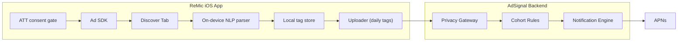
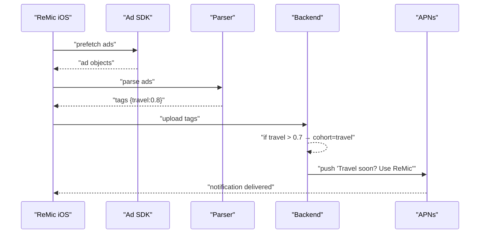

# Hackathon Report — Building AdSignal

This report outlines how to **build AdSignal** at a hackathon, based on prior brainstorming and design documentation. It’s structured as a tech specification and playbook so you can execute quickly during your next event.

Idea: Instead of trying to directly track user browsing/search behavior (which Apple locks down), you piggy-back on the ads already being delivered to the user. Since ad networks (Google, Meta, etc.) optimize ads based on the user’s recent cross-app/web activity, the ads themselves become a “proxy signal” for the user’s current interests. Let me break it down.

---

## 1. Hackathon Goal

- Prototype **AdSignal**, a system that turns ads shown in your iOS app into **signals of user intent**.
- Show how these signals can trigger **timely, personalized notifications** that drive re-engagement.
- Deliver a working demo + a compelling story for judges/investors.

---

## 2. Core Concept

> Ads served by Google/Meta SDKs are already personalized based on user activity. By parsing these ads on-device, abstracting intent tags, and feeding them into a backend engine, we can trigger re-engagement nudges that align with the user’s real-time interests.

---

## 3. Hackathon MVP Scope

- **iOS App (ReMic fork/demo):**
  - Integrate Ad SDK (AdMob or Meta Audience Network).
  - Add a *Discover Tab* to render ads.
  - Prefetch ads opportunistically.
- **On-device Ad Parser:**
  - Extract titles and metadata.
  - Map to simple categories (travel, education, dating, etc.).
- **Backend Service:**
  - Collect aggregated tags daily.
  - Run simple rules (≥70% travel ads = travel cohort).
  - Map cohorts to notification templates.
- **Push Notification Demo:**
  - Trigger via APNs with personalized text.

---

## 4. Architecture

### High-Level System



### Notification Trigger Example



---

## 5. Module Names

- **AdSignal** (umbrella)
- **SignalTap** → On-device capture
- **AdEcho** → Intent extraction
- **Reverb** → Notification orchestration
- **Pulse** → Analytics view (optional)

---

## 6. Hackathon Deliverables

1. **Demo App:** iOS app with Discover tab + push notification demo.
2. **Backend Stub:** Simple Node.js/TS server with rule-based cohort detection.
3. **Notifications:** At least 2 contextual notification examples (travel, education).
4. **Pitch Slide:** Explaining AdSignal → SignalTap → AdEcho → Reverb.
5. **Architecture Diagram:** As above, included in slides.

---

## 7. Storytelling Angle

- **Problem:** Notifications are generic and ignored; retention is expensive.
- **Solution:** Ads already reflect intent → AdSignal converts them into smart nudges.
- **Demo:** User opens Discover → sees travel ads → later receives travel-specific notification.
- **Vision:** AdSignal as the “intent OS” for mobile apps.

---

## 8. Hackathon Execution Checklist

-

---

## 9. Key Takeaway

AdSignal is a **hackable but powerful concept**: turning ad networks’ personalization into a free source of intent signals, and converting those signals into **high-conversion notifications**. At a hackathon, even a simple demo (ad → travel tag → push notification) can powerfully showcase the idea and vision.


---

# AdSignal Hackathon Build Report (Runbook)

> A practical blueprint to build and demo **AdSignal** in a 24–36 hour hackathon. This report assumes the methodology and diagrams above; it focuses on scope, roles, tasks, data contracts, guardrails, and a precise demo script.

## 0) TL;DR

- Build a **Discover** tab that shows ads via Ad SDK(s).
- On-device, parse ad text → map to **interest tags** (e.g., `travel`, `education`).
- Upload **daily aggregated** tags (no raw creatives) to the backend **Privacy Gateway**.
- Backend turns tags into **re-engagement notifications** via rules/A-B.
- Demo: see travel ads → receive “Travel with ReMic” push → open deep link → run a travel phrase practice.

---

## 1) Goals & Success Criteria

**Primary Goal:** Demonstrate end-to-end signal → notification loop in a single device.

**Success Criteria**

- ✅ Ads render in **Discover**.
- ✅ On-device tag extraction works (debug view shows `{travel:0.8}` etc.).
- ✅ Aggregated payload reaches server (logs + dashboard).
- ✅ Rule fires → APNs delivers push within 30s in demo mode.
- ✅ Deep link opens the app to **Practice/Travel** screen.
- ✅ Metrics recorded: push sent/opened, session start, conversion.

**Nice-to-Haves**

- Cohort dashboard (**Pulse**) with simple charts.
- A/B variant toggles for message copy.
- Throttling/fatigue keys per trigger.

---

## 2) Scope & Non‑Goals

**In‑Scope**

- iOS client with Ad SDK (AdMob as default), Discover UI, on-device parser, local store & uploader.
- Minimal backend: Privacy Gateway (HTTP), Rules/Scorer, Notification service to APNs, Metrics sink.
- Opt-in UX for **Interest-based Tips** (separate from ATT).

**Out‑of‑Scope (Hackathon)**

- Multi-language push localization (can be stubbed).
- Complex ML; start with keyword/regex + optional tiny Core ML.
- Cross-platform clients.
- Data warehouse/BI; use logs + a lightweight dashboard.

---

## 3) Roles (or Tracks if Solo)

- **iOS Lead (SignalTap)**: SDK integration, parser, local store, debug UI, deep links.
- **Backend Lead (Reverb)**: Gateway, rules engine, notifier (APNs), metrics endpoints.
- **NLP/ML (AdEcho)**: Tag taxonomy, keyword lists, lightweight classifier.
- **Demo/PM (Pulse)**: Privacy copy, opt-ins, scripts, slides, timing.

If solo: do them **in this order** → iOS Discover → Parser+Debug → Gateway+Notify → Rules → Opt-in → Dashboard → Polish.

---

## 4) Implementation Plan (Hour Blocks)

### Phase A — iOS Client (0–8h)

1. **Project setup**: add AdMob SDK, enable ATT prompt, add **Discover** tab.
2. **Render ads**: banner/native ad list; add **Prefetch** button (avoid BG fetch fragility for demo).
3. **Parser stub**: extract `title`, `body`, `category` when exposed; run keyword map → tag scores.
4. **Debug overlay**: show latest tags JSON and confidence.
5. **Local store**: roll up daily `{tag: score}` in SQLite/CoreData.
6. **Uploader**: POST aggregated tags to `/v1/interests` on demand (debug button) and on app foreground.

### Phase B — Backend (6–14h)

1. **Privacy Gateway** (Express/FastAPI): auth token, schema validation, log to stdout + KV.
2. **Rules/Scorer**: simple thresholds, e.g., `travel ≥ 0.6` in last 24h → `travel_interest_high`.
3. **Notifier**: APNs token-based auth; send push with deep link `remic://practice/travel`.
4. **Metrics**: `/v1/events` for `push_sent`, `push_open`, `conversion_travel_practice`.

### Phase C — UX & Compliance (10–16h)

1. **Opt-in screen**: “Enable Interest-based Tips” toggle (separate from ATT).
2. **Privacy copy**: “We derive coarse interests on-device from ad text; we upload only daily aggregates. You can turn this off anytime.”
3. **Throttling**: client-side & server-side fatigue key `travel_nudge` ≤ 1 per 7 days (hackathon: 1 per 3 min in demo mode).

### Phase D — Dashboard (14–20h)

1. Simple web page (Next.js/React) to list last N interest snapshots and pushes sent.
2. Tiny chart for **Pulse** (tag trends last 24h).

### Phase E — Polish & Rehearsal (20–24/36h)

- Run the end-to-end loop 5x. Record timings, ensure push reliability. Prepare fallback if APNs flaky (in-app banner).

---

## 5) Data Contracts (Minimal, Stable)

### Device → Gateway `/v1/interests`

```json
{
  "user_id": "hashed_user_id",    
  "day": "2025-08-24",
  "cohorts": [
    {"name": "travel", "score": 0.74},
    {"name": "airline", "score": 0.61}
  ],
  "source": "ad_observation_v1",
  "counts": {"ads_seen": 12, "sdk": {"admob": 9}},
  "app": {"ver": "1.3.0", "ios": "18.0"}
}
```

### Gateway → Rules (internal event)

```json
{
  "user_id": "hashed_user_id",
  "window_hours": 24,
  "tags": {"travel": 0.74, "airline": 0.61}
}
```

### Rules → Notifier (trigger)

```json
{
  "user_id": "hashed_user_id",
  "trigger": "travel_interest_high",
  "variant": "travel_nudge_v2",
  "message": "Planning a trip? Use ReMic to speak like a local.",
  "deep_link": "remic://practice/travel",
  "throttle_key": "travel_nudge",
  "demo_mode": true
}
```

### Client → Metrics `/v1/events`

```json
{
  "user_id": "hashed_user_id",
  "events": [
    {"name": "push_sent", "ts": 1724630400},
    {"name": "push_open", "ts": 1724630452},
    {"name": "conversion_travel_practice", "ts": 1724630467}
  ]
}
```

---

## 6) Tag Taxonomy (v0)

- **travel**, airline, hotel, visa, insurance
- **education**, language\_learning, tutoring
- **dating**, social, events
- **finance**, banking, credit\_card
- **shopping**, deals, coupons

Start with ≤30 tags; maintain as a static JSON delivered with app; allow hotfix via remote config.

---

## 7) On-Device Parser (AdEcho v0)

- **Inputs**: ad `title`, `body`, `callToAction`, `category` (when exposed by SDK).
- **Algorithm**: keyword list with weights + simple normalization; optional Core ML text classifier (MobileBERT mini) if time permits.
- **Output**: `{tag: score}` map with values in `[0,1]` and overall confidence.
- **Privacy**: do **not** store raw strings; persist only derived tags.

**Pseudocode**

```swift
struct TagScore { let name: String; var score: Double }
let keywords: [String: [String: Double]] = [
  "travel": ["flight":0.6, "airline":0.5, "hotel":0.4, "visa":0.4, "luggage":0.3],
  "education": ["course":0.5, "learn":0.4, "lesson":0.4, "language":0.6]
]
func tags(from text: String) -> [TagScore] {
  var scores: [String: Double] = [:]
  for (tag, dict) in keywords {
    for (kw, w) in dict where text.lowercased().contains(kw) { scores[tag, default:0] += w }
  }
  let maxScore = max(scores.values.max() ?? 1, 1)
  return scores.map { TagScore(name: $0.key, score: min($0.va
```

⸻

8) Rules & Throttling (Reverb v0)
    •    Trigger: if travel ≥ 0.6 in last 24h and travel_nudge not sent in last 7d → enqueue push.
    •    Demo Mode: window=2m, fatigue=3m, so judges see immediate result.
    •    A/B: toggle travel_nudge_v1 vs v2 copy.

⸻

9) Notification Delivery
    •    APNs with token-based auth (P8 key). Category = travel_tip. Deep link = remic://practice/travel.
    •    Fallback: if APNs fails, display in-app banner when app foregrounded.

⸻

10) Privacy & Compliance Guardrails
    •    ATT consent required before enabling SignalTap.
    •    Separate toggle for Interest-based Tips (purpose limitation, explicit opt-in).
    •    Store only aggregated tags; no raw creatives, IDs, or click trackers.
    •    Rate-limit uploads; implement delete data endpoint per user.
    •    Document flows in Privacy Policy; easy opt-out in Settings.

⸻

11) Testing Checklist
    •    Simulator + device test for ATT + ad rendering.
    •    Parser unit tests: input strings → expected tags.
    •    End-to-end: button → upload → rule → push (record timestamps).
    •    Negative tests: no ATT consent → SignalTap disabled.
    •    Fatigue tests: ensure repeated triggers are suppressed.

⸻

12) Demo Script (5 minutes)
    1.    Open ReMic → toggle “Interest-based Tips” → Discover tab.
    2.    Tap Prefetch Ads → show ads + Debug overlay with {travel:0.8}.
    3.    Tap Send Snapshot (uploads aggregates) → backend logs show receipt.
    4.    Push arrives: “Planning a trip? Use ReMic to speak like a local.”
    5.    Tap notification → deep link opens Travel Practice screen.
    6.    Show Pulse dashboard: tags, push sent/opened, conversion.
    7.    Close with guardrails (privacy, ATT, aggregates only) and roadmap.

⸻

13) Stretch Goals
    •    On-device Core ML classifier fine-tuned on ad snippets.
    •    Multi-network support (Meta Audience Network) with adapter interface.
    •    Real-time edge rules (Cloudflare Workers) for faster pushes.
    •    Cohort personalization (beginner vs advanced learners).
    •    Basic revenue estimate: lift in 7-day retention → LTV gain.

⸻

14) Risks & Mitigations
    •    Ad SDK ToS: analyze only exposed text; no scraping of assets.
    •    APNs unreliability: keep in-app banner fallback; cache deep link action.
    •    Background fetch limits: drive via user action during demo; BG later.
    •    No travel ads served: include mock ad toggle that feeds parser with travel keywords.

⸻

15) Appendix — Minimal Backend (Express)

import express from "express";
const app = express();
app.use(express.json());
app.post("/v1/interests", (req, res) => {
  console.log("interests", req.body);
  // TODO: store + evaluate rules; enqueue APNs
  res.sendStatus(202);
});
app.post("/v1/events", (req, res) => { console.log("events", req.body); res.sendStatus(202); });
app.listen(8787, () => console.log("gateway up"));


⸻

16) Appendix — Notification Copy Bank
    •    Travel: “Planning a trip? Use ReMic to speak like a local.”
    •    Education: “Learning Spanish? Practice a conversation with ReMic today.”
    •    Dating: “Meeting new people? Break the ice in their language with ReMic.”
    •    Return: “Welcome back! Pick up where you left off with ReMic.”

⸻

17) Final Notes

Ship the happy path first. Optimize for a crisp, repeatable demo that proves the loop: ads → tags → rule → push → deep link → practice. Then iterate.
